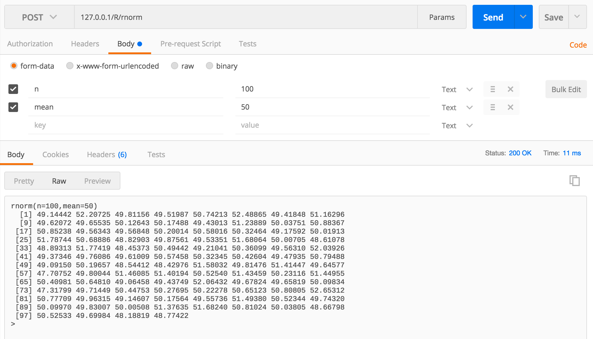

# RExpress

## Synopsis

RExpress is a *convenient*, *minimalist* and **fast** R wrapper written in node.js, on top of Express, allowing you to build a simple **HTTP API** over your R application.

To improve reactivity and replicability, RExpress is :

- stateless
- asynchronous
- made of a *pool of active R interpreters* (to avoid interpreter/libraries/data loading on each call)

## Code Example

```bash
# SERVER

# -- assuming R is installed
#    and your custom preload scripts are in /R folder
node ./api.js

# CLIENT

# -- execute a script given in body
curl -X POST -d 'a <- "Hello World"\n a \n' "http://127.0.0.1/R/"
> [1] "Hello World"

# -- call 'qnorm' built-in function (value at the p percentile of normal distribution)
curl -X POST -H "Content-Type: multipart/form-data; " -F "p=.42" "http://127.0.0.1/R/qnorm"
> qnorm(p=.42)
[1] -0.2018935

# -- call a custom function (defined in /R/awesome.R)
curl -X POST -H "Content-Type: multipart/form-data; " -F "x=24" -F "y=42" "http://127.0.0.1/R/awesomefn"
> awesomefn(x=24,y=42)
[1] 2340
```

Below an example in Postman, for a function returning several values.




## Installation

```bash
# clone repo
git clone theplatypus/RExpress
cd RExpress

npm install

cd ./lib
node ./api.js 	# nb_workers = 4 * nb_threads
node ./api.js 4 # 4 workers

```

## API Reference

The default API exposes two main endpoints :

### Function call

*POST http://ip:port/R/%function%*

Read the form-data arguments given to call the function (replace this parameter with the actual function name).
Users actions are therefore restricted to this particular function scope.

```javascript
// api.js
// call a function w/ form-data (safe)
.post('/R/:function', upload.array(), function (request, response) {
	// ...
})
```

### Script execute

*POST http://ip:port/R*

Interpret the whole POST body as a R program to execute.
As you imagine, it is very unsafe to do that, especially if your program have access to some data.
Testing purposes only, do not use in production.

```javascript

// execute the R program given in body
// -- very unsafe but useful in testing purposes
.post('/R', text_parser, function (request, response) {
	// ...
})
```
## Tweaking

There are two main ways to adapt this package towards your needs.

### Pool size

To avoid interpreter/libraries/data loading on each call, several interpreters are maintained in an active state in a pool.
Each call results in a pipe with one of those interpreters.
As R is single-threaded by default, you could choose to create as many worker as your CPU exposes threads.

To tweak this parameter, change the *nb parameter* at the pool creation in api.js

### Custom Scripts

If the workers should have data or libraries preloaded, you can store them in .R files and save them in the /R folder.

## Docker

You can use the Dockerfile to build a container with necessaries dependencies.

```bash
# clone repo
git clone theplatypus/RExpress
cd RExpress

# build image
docker build -t seed/RExpress .

# run image in a container
docker run \
	-p 8080:80 \
	--env NB_WORKERS="4" \
	seed/RExpress

# access RExpress at 192.168.99.100:8080 (your docker bridge0 addr)

```
## Issues and roadmap

- deal with long scripts (automatic cut in several jobs)

## Contributors

theplatypus

## License

MIT
